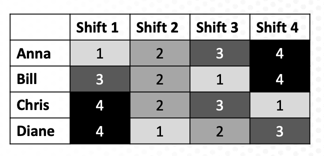

# The Employee Scheduling Problem

Exercise for D-Wave training courses to demonstrate the DQM solver.

## Exercise 1

We'll be working with the file `scheduling_preferences.py`. This program considers four employees that need to be assigned to four open shifts.  Each employee has a ranking/preference amongst the four shifts according to the image below, where 1 is most preferred and 4 is least preferred.

Open the code file `scheduling_preferences.py` and take a look at how we're building up our discrete quadratic model, or DQM.

1. Initialize the DQM object with `dqm = DiscreteQuadraticModel()`.
2. Add the variables we're using with `dqm.add_variable(...)`.
3. Set the linear biases with `dqm.set_linear(...)`.

Note that this problem does not have any quadratic biases - we're only considering the employees' individual rankings at this time.

## Exercise 2

For this exercise, we'll work with the file `scheduling_addemployees.py`. This file is very similar to `scheduling_preferences.py`, and you will be adding additional employees to the schedule.  Add the following employees with their associated preferences for shifts 1-4 in the function `employee_preferences()`. 

1. Erik: [1,3,2,4]
2. Francis: [4,3,2,1]
3. Greta: [2,1,4,3]
4. Harry: [3,2,1,4]

When you run this problem, you should see two employees scheduled for each shift.

## Exercise 3

In this next exercise, we'll work with the file `scheduling_restrictions.py`. In this problem, we have 8 employees and 4 different shift options.  We've set up the initial DQM model for all 8 employees with their preferences over the 4 shifts. Now we need to take into account the following restrictions.

1. Anna is not able to work during shift 4.
2. Bill and Frank cannot work during the same shift.
3. Erica and Harriet would like to work the same shift.

Modify the function `build_dqm()` to reflect these additional constraints. Note that when you run your program, you may not have two employees per shift this time.

## Challenge: Exercise 4

For this final exercise, start with your completed file `scheduling_restrictions.py` from Exercise 3.  The optimal solution for Exercise 3 had some days with just 1 person scheduled and others with many more.  Add some linear and/or quadratic biases to your DQM so that each shift gets exactly two people scheduled.

HINT: This challenge exercise will require you to think of your discrete variables/cases as individual binary variables.  For example, if variable Erik has cases 1, 2, 3, and 4, this is equivalent to four binary variables: Erik/Shift 1, Erik/Shift 2, Erik/Shift 3, and Erik/Shift 4.

## License

Released under the Apache License 2.0. See [LICENSE](LICENSE) file.
